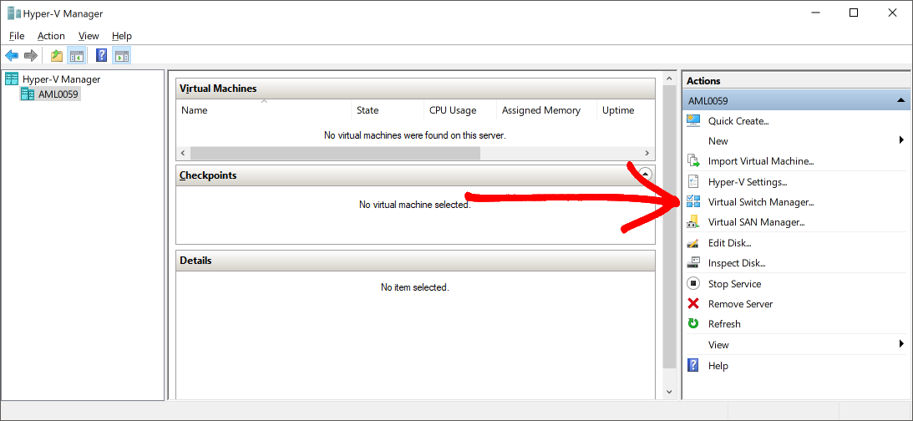
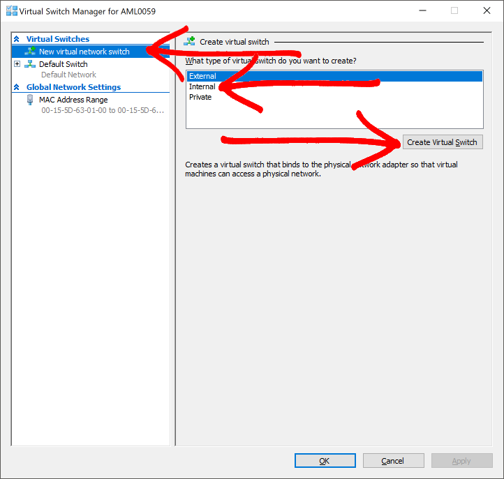
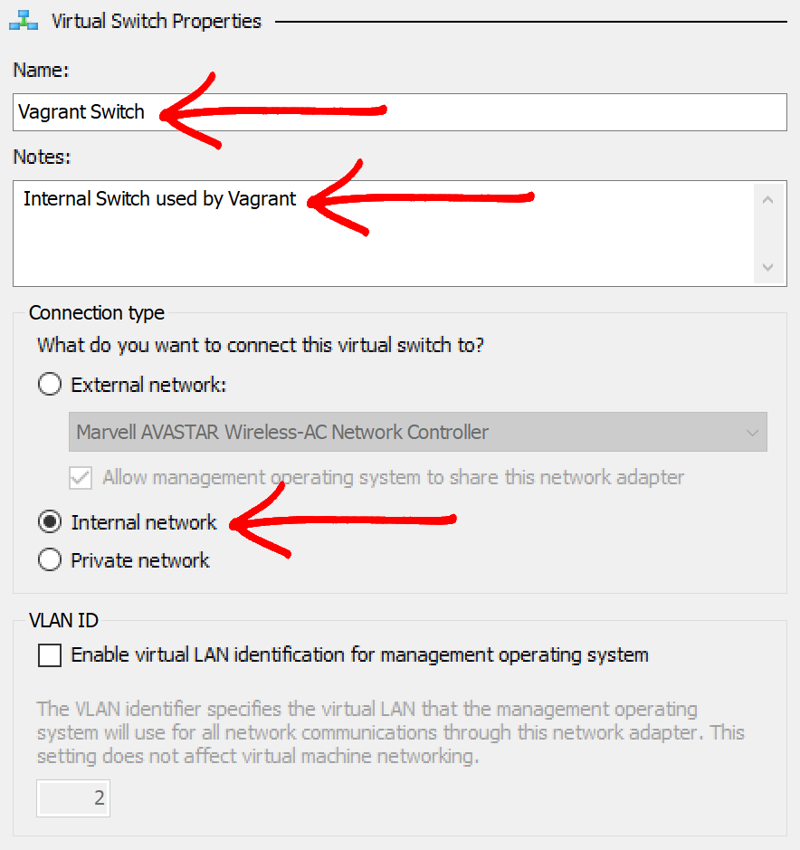
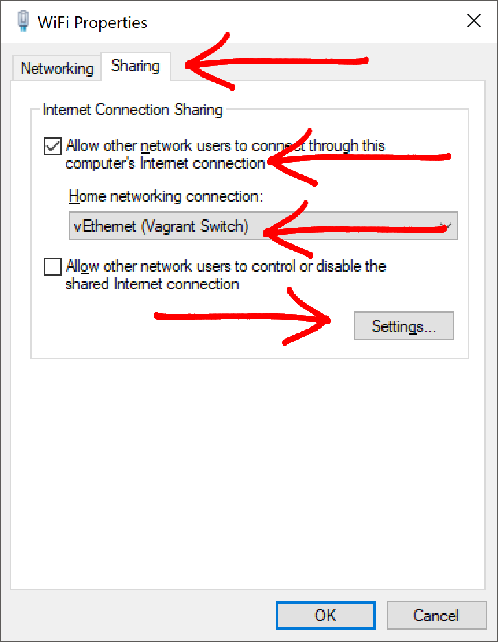
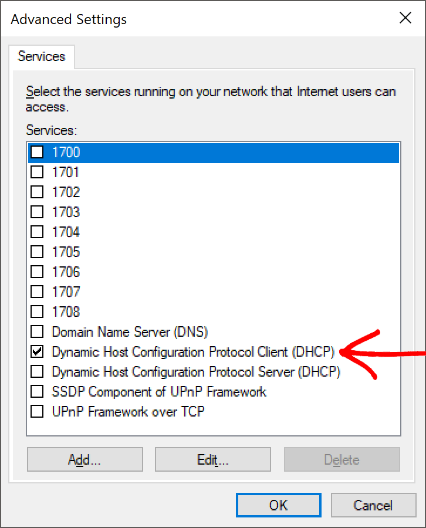

# Linux Local Development Environment

Support for the following technologies:

-   Jenkins
-   Ansible
-   SonarQube
-   Kubernetes
-   Nginx Reverse Proxy

## Hyper-V Virtual Network Configuration

Because Hyper-V is not fully integrated with Vagrant's networking configuration the following manual steps must be completed.

### Configure Hyper-V

If you use the defaut configuration of Hyper-V then your Vagrant box will be bound to one of your network adapters, if like me you switch between WiFi and Ethernet in different situations this could become a problem.

1.  Open the Hyper-V Manager and select "Virtual Switch Manager" from the right hand side.

    

2.  Configure the Switch

    1.  Select "New virtual network switch"
    2.  Select "Internal" as the type of network Switch
    3.  Click "Create Virtual Switch"

        

3.  In the virtual switch properties, give the switch a name, description and double check that internal network is selected.

    

### Configure Windows Networking

1.  Open Control Panel:

      Control Panel ➔ Network and Internet ➔ Network and Sharing Centre

2.  Find your WiFi or Ethernet connection right click it and choose properties.

    

3.  Switch to the "Sharing" tab

    1.  Check "Allow other network users to connect..."
    2.  Select "vEthernet (Vagrant Switch)" from the "Home networking connection" dropdown.
    3.  Click "Settings"

    

4.  Check "Dynamic Host Configuration Protocol Client (DHCP)"

    

5.  Click "OK" and then "OK" again

6.  Repeat 1-5 for each network network adapter you use.
